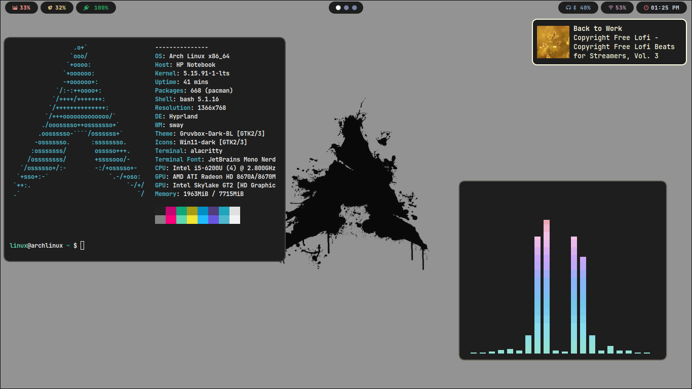

> Open To Any Suggestions 

# Arch-Hyprland

### Youtube Video:

[](https://www.youtube.com/watch?v=Y_6kHCsSPRk&lc=UgwOJ1boNcTiokyl_Yp4AaABAg)

## Themes, cursors and icons : 
1. [Whitesur cursors](https://www.pling.com/p/1411743/)
2. [Windows 11 Icon pack](https://www.pling.com/p/1546069/)
3. [Gruvbox Dark GTK theme](https://www.gnome-look.org/p/1681313/#:~:text=Gruvbox%20GTK%20Themes&text=The%20idea%20was%20born%20from,unique%20look%20to%20working%20environments.)

4. [Gruvbox Dark kvantum theme](https://github.com/thefallnn/Gruvbox-Kvantum)

### Dependencies :
```sh
yay --needed -S polkit-kde-agent dunst grim rofi-lbonn-wayland-git rofi-emoji \
wl-clipboard wf-recorder hyprpicker-git hyprpaper-git \
xdg-desktop-portal-hyprland-git ffmpegthumbnailer tumbler  \
swaylock-effects qt5-wayland qt6-wayland ripgrep  \
thunar thunar-archive-plugin file-roller wtype colord \
waybar-hyprland-git
```
### Fonts :
```sh
yay --needed -S ttf-jetbrains-mono ttf-jetbrains-mono-nerd noto-fonts-emoji

```


